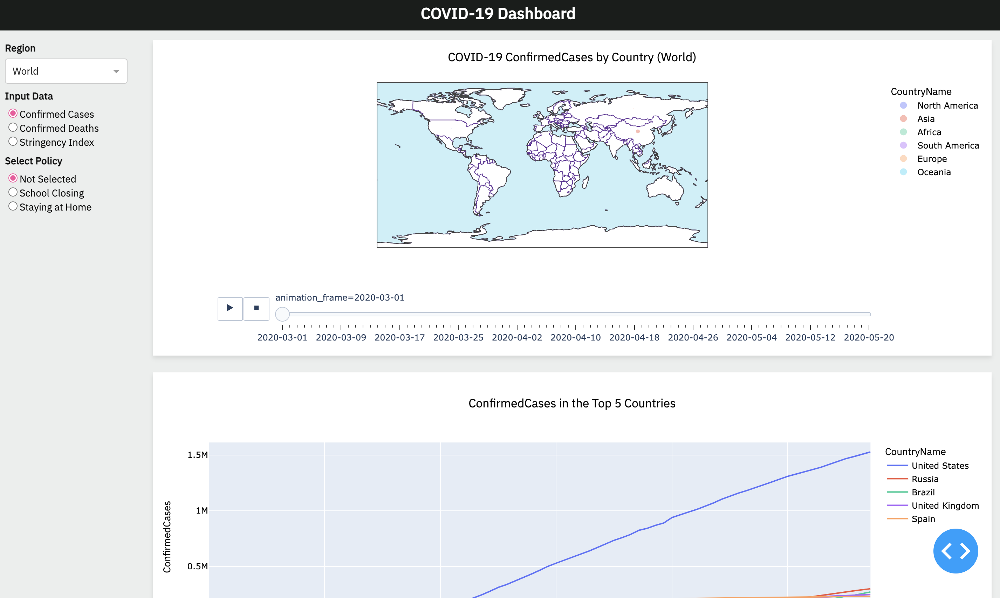

# Interactive COVID-19 Dashboard (Python, Pandas, Plotly, Dash)

.png>)

## Overview

Welcome to the Interactive COVID-19 Dashboard, a powerful tool to visualize and track COVID-19 data using Python libraries Plotly and Dash. This project retrieves real-time COVID-19 data from the OxCGRT API, cleans and organizes it with Pandas DataFrames, and presents insightful visualizations with Plotly.

## Features

- **Real-Time Data**: Retrieve live COVID-19 data from the OxCGRT API using Python requests and JSON for up-to-date information.

- **Data Wrangling**: Clean and wrangle raw data into structured Pandas DataFrames, making it ready for analysis and visualization.

- **Informative Visuals**: Create dynamic visualizations and graphs with Plotly to showcase key metrics such as confirmed cases, deaths, and infection rates over time.

- **Interactive Filters**: Develop user-friendly filters with Dash to segment and compare COVID data by countries and regions.

- **Responsive Design**: Enable users to track and comprehend the spread and timeline of COVID-19 through dynamic, responsive visuals.

- **Optimized Performance**: Optimize the dashboard for performance by caching data and implementing callbacks for fast load times.

### Tech Stack

- **Python**: The project is developed using Python, a versatile programming language that is well-suited for data analysis and visualization.

- **Dash**: Dash, a Python framework, is employed to create the interactive web-based dashboard, enabling real-time data visualization and user interaction.

- **Plotly**: Plotly, a Python graphing library, is used to generate dynamic and informative visualizations and graphs, enhancing the understanding of COVID-19 data.

- **Pandas**: Pandas, a popular data manipulation library, is utilized to clean, organize, and structure the raw COVID-19 data from the OxCGRT API into Pandas DataFrames.

- **OxCGRT API**: Real-time COVID-19 data is retrieved from the OxCGRT API using Python requests and JSON for seamless data acquisition.

### Achievements

- **Real-Time Data**: Successfully integrated real-time COVID-19 data from the OxCGRT API, ensuring that users have access to the latest information.

- **Data Wrangling**: Implemented effective data cleaning and wrangling techniques, resulting in well-structured Pandas DataFrames ready for analysis.

- **Informative Visuals**: Created engaging and informative visualizations using Plotly, allowing users to grasp key metrics like confirmed cases, deaths, and infection rates over time.

- **Interactivity**: Developed interactive filters with Dash to enable users to segment and compare COVID-19 data by countries and regions with ease.

- **Performance Optimization**: Optimized dashboard performance by caching data and implementing callbacks, ensuring fast load times even with extensive datasets.

- **User-Focused Design**: Prioritized a responsive and user-friendly design to enhance the user experience and facilitate the tracking and comprehension of COVID-19 spread and timeline.

This project represents a successful fusion of technology and data analysis, providing a valuable tool for tracking and understanding the ongoing COVID-19 pandemic.
